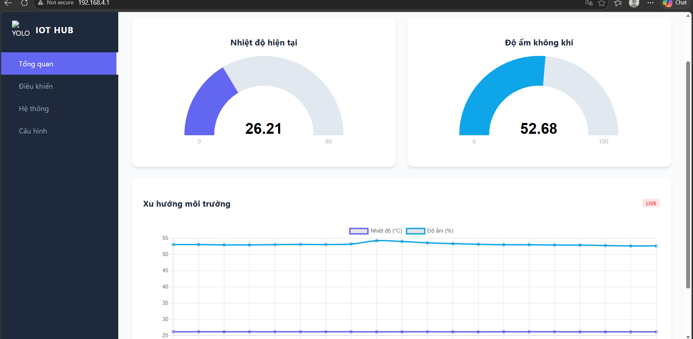

# Smart Environment Monitor with TinyML & IoT (Yolo Uno)

A smart environment monitoring project using **Yolo Uno (ESP32-S3)**, integrating:

*  **FreeRTOS** (real-time multitasking)
*  **TinyML (TensorFlow Lite Micro)**
*  **IoT (ThingsBoard)**

---

##  Key Features

*  **Real-time monitoring**
  Collects data from:

  * Temperature and humidity (**DHT20**)
  * Light intensity (**LDR**)

*  **Local display**
  Displays data on **LCD 1602 I2C**

*  **Smart alerts**
  **NeoPixel RGB LED** changes state based on alert level (`isAlert`)

*  **Artificial Intelligence (TinyML)**
  Predicts environmental states:

  * Normal
  * Fan ON
  * Light ON
  * Warning

*  **IoT connectivity**

  * Sends data to **ThingsBoard Dashboard**
  * Receives remote control commands (RPC)

*  **Multitasking**
  Uses **FreeRTOS** to run multiple independent tasks

---
##Dashboard


## Hardware Used

*  **Board**: Yolo Uno (ESP32-S3)

*  **Sensors**

  * DHT20 (I2C) – Temperature & Humidity
  * LDR (Analog) – Light

*  **Display**

  * LCD 1602 I2C (0x27 / 0x3F)

*  **LED**

  * NeoPixel RGB (GPIO 48)

---

## Connection Diagram (Pinout)

| Component   | ESP32-S3 | Interface |
| ----------- | -------- | --------- |
| LCD (SDA)   | GPIO 11  | I2C       |
| LCD (SCL)   | GPIO 12  | I2C       |
| DHT20 (SDA) | GPIO 11  | I2C       |
| DHT20 (SCL) | GPIO 12  | I2C       |
| LDR         | GPIO 4   | Analog    |
| NeoPixel    | GPIO 48  | Onboard   |

---

## ⚙️ Setup & Usage

### 🔧 Requirements

* VSCode + PlatformIO

### 📚 Libraries

```ini
robtillaart/DHT20
marcoschwartz/LiquidCrystal_I2C
adafruit/Adafruit NeoPixel
tanakamasayuki/TensorFlowLite_ESP32
thingsboard/ThingsBoard
